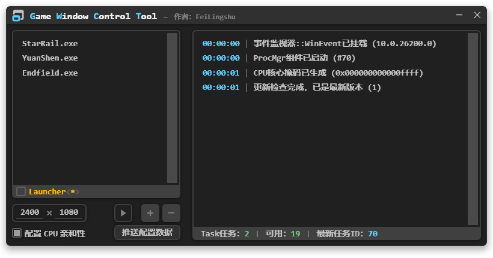

# __`GWCT`&nbsp;&nbsp;`Game Window Control Tool`__

<blockquote>
  <div align="Left">
    
  </div>
  <strong>&nbsp;&nbsp;· UI 效果图</strong>
</blockquote>

<a id="warn">

> [!WARNING]
> - ___并非所有游戏都支持 [[根据窗口大小参数动态调整分辨率](#warn)] 的功能___
> - ___并非所有游戏都允许 [[运行时调整窗口大小](#warn)] 的行为___

</a>

```
程序集信息 (程序集已强签名)
名称：GWCT
架构：AnyCPU
签名公钥：0024000004800000940000000602000000240000525341310004000001000100ade4a76802241de71f5bc96986bb265d675562e388c3eb234667df86face1485948aab7587f35669c8811b6c4194c09152270bd20efda25e75e118eb350ca024bc31a12c28b17d79ca11b2f177240d663253f6db3badf5a16459a4c036e0272a0fe267d7eb5406cde63e394e5847faa2cb2be4c2617aab66b103c2925d7477d1
加密方式：SHA1
文件大小：79,360 字节
```

### __程序功能__

- [x] __自定义游戏窗口大小__
  - __游戏需以窗口化运行__
  - __窗口大小自适应，不超过主屏幕工作区__
  - __窗口位置自适应，位于主屏幕居中偏下__
- [x] __可同时自定义多个目标游戏__
  - __添加的游戏数量过多可能导致核心服务压力升高，引发性能开销提升__
- [x] __配置全程可保持__
- [x] __可切换窗口位置锁定__
  - __使用 `F12` 快捷键__
- [x] __配置文件支持热重载__
- [x] __修改窗口显示样式__
  - __`Windows 11 +` 窗口圆角+调整窗口框架颜色__
  - __`Windows 10 build 19041 +` 调整窗口框架颜色__
  - __`Windows 10 build 18985 +` 切换为暗色模式__
  - __`Windows 10 build 17763 +` 尝试使用早期暗色模式__
  - __`Earlier Versions` 不受支持__
  - __配置可能失败，但不会影响使用__
- [x] __支持 `CPU` 核心亲和性调整__
  - __该功能仅在 `Intel` 大小核架构生效 (绑定 `P-Core`)__
  - __当逻辑处理器数量超过64个 (32位系统为32个) 时，由于相关限制，该功能不会生效__
- [x] __提供启动"游戏启动器"功能__
  - __该功能是为了防止某些启动器保护游戏进程，导致无法配置核心亲和性 (点名批评米哈游)__
- [x] __显示运行日志__
- [x] __自动更新检查__

> [!TIP]
> - ___程序会尝试检查游戏窗口是否支持调整，若不支持则会主动忽略___
> - ___检测到运行过程中频繁重置窗口大小时，核心功能将会熔断，避免频繁触发重置造成系统卡顿 (点名批评地平线6)___

### __性能表现__

> __程序性能表现良好__

- __单文件运行，极小包体(约77.5KB)__
- __运行过程中极少占用CPU和内存，自身会配置效能模式(不受支持时会退化成低进程优先级模式)__
- __使用 `ProcMgr` 组件，实现高速低开销进程快照和筛选__
- __使用 `WinEvent` 组件，窗口调整实时响应__

### __运行环境__

<pre><code>需要 .Net Framework 4.8 运行时
下载链接：<a href="https://dotnet.microsoft.com/zh-cn/download/dotnet-framework/net48">https://dotnet.microsoft.com/zh-cn/download/dotnet-framework/net48</a>
注意：
  · 普通用户选择"运行时"版本即可
  · 如需自行编译，则需安装"开发包"
  · 如使用"脱机安装程序"，则需自行下载对应的地区语言包</code></pre>
